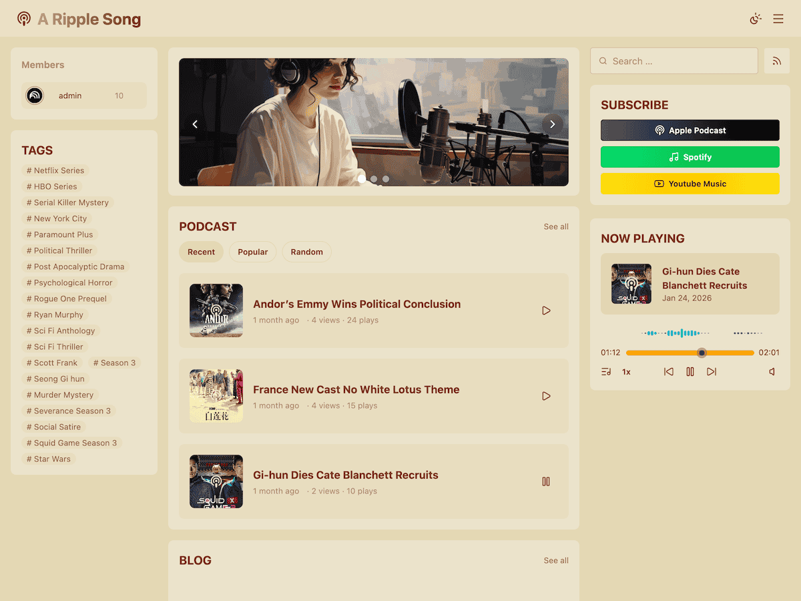

# A Ripple Song Podcast

A Ripple Song Podcast — это плагин подкастов для WordPress, который добавляет на сайт возможности публикации и управления подкастами, а также умеет генерировать Podcast RSS для крупных платформ. Для полного набора возможностей используйте его вместе с совместимой темой [A Ripple Song](https://github.com/jiejia/a-ripple-song).

## Особенности

- Типы записей и категории для подкастов, упрощающие публикацию и управление выпусками
- Автоматическое извлечение аудиометаданных (длительность, размер файла, формат) в соответствии со стандартами iTunes и Podcasting 2.0
- Встроенная генерация RSS для быстрой отправки на основные подкаст-платформы
- Поддержка интернационализации

## Технологический Стек

- [Carbon Fields](https://github.com/htmlburger/carbon-fields) - Фреймворк пользовательских полей для WordPress
- [getID3](https://github.com/JamesHeinrich/getID3) - Библиотека анализа аудиометаданных
- [PHP-Scoper](https://github.com/humbug/php-scoper) - Инструмент изоляции пространств имен PHP

## Ссылки

- [Официальный сайт](https://doc-podcast.aripplesong.me/)

## Языки

- [English](../README.md)
- [简体中文](README.zh_CN.md)
- [繁體中文](README.zh-Hant.md)
- [日本語](README.ja.md)
- [한국어](README.ko_KR.md)
- [Français](README.fr_FR.md)
- [Español](README.es_ES.md)
- [Português (Brasil)](README.pt_BR.md)
- [Русский](README.ru_RU.md)
- [हिन्दी](README.hi_IN.md)
- [বাংলা](README.bn_BD.md)
- &lrm;[العربية](README.ar.md)
- &lrm;[اردو](README.ur.md)

## Лицензия

Распространяется по открытой лицензии [GPL-3.0](https://github.com/jiejia/a-ripple-song-podcast/blob/main/LICENSE).
