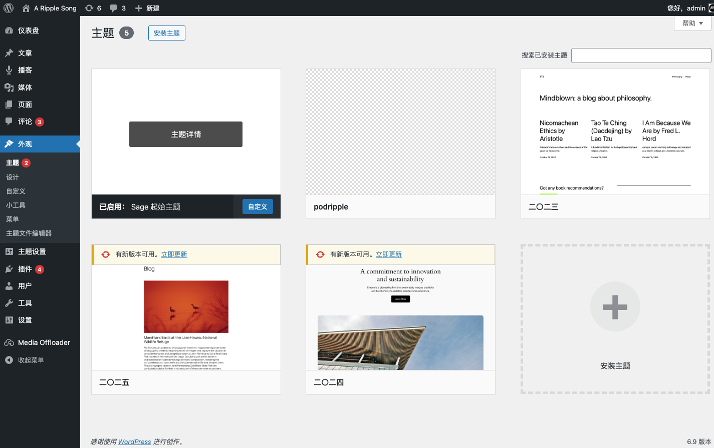
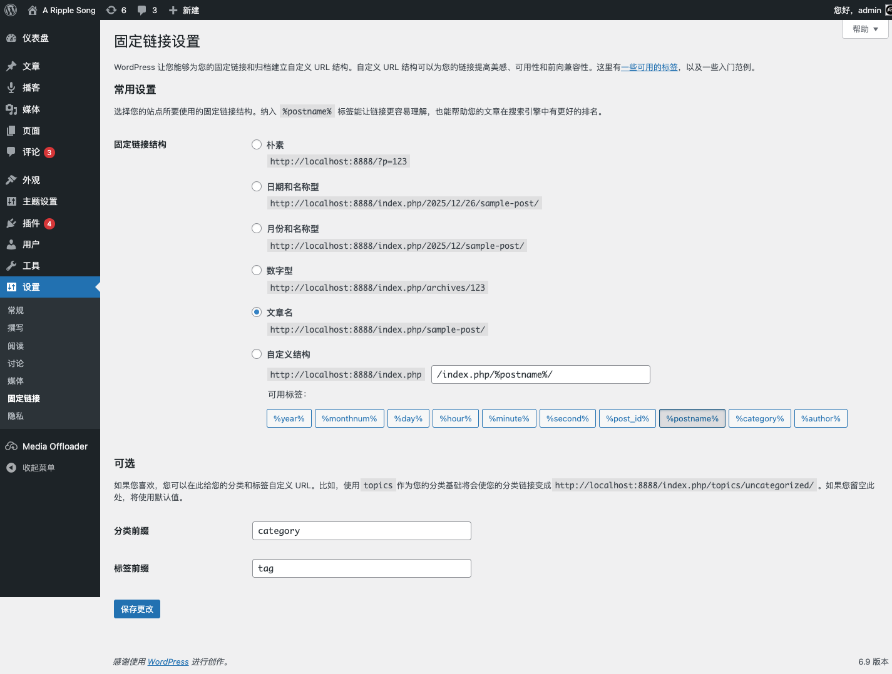
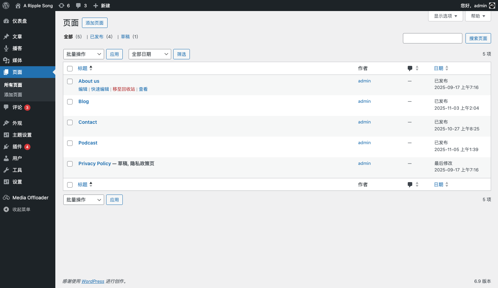
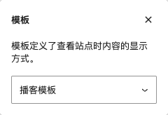
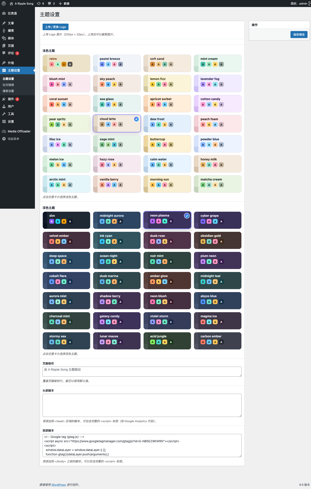
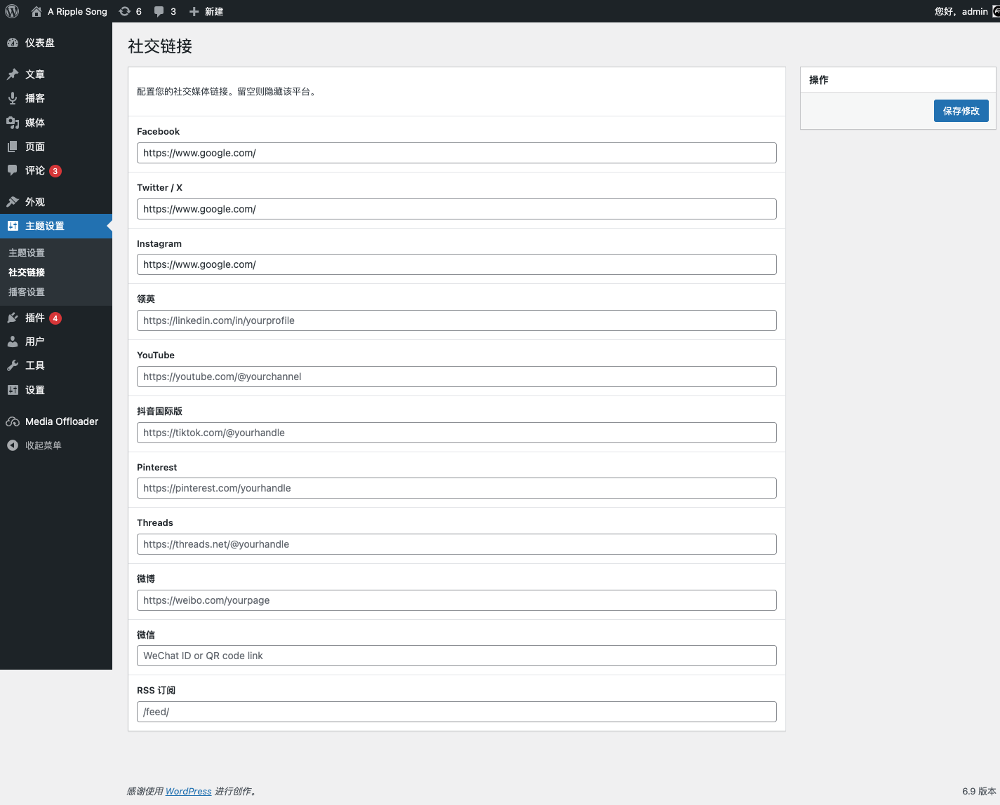
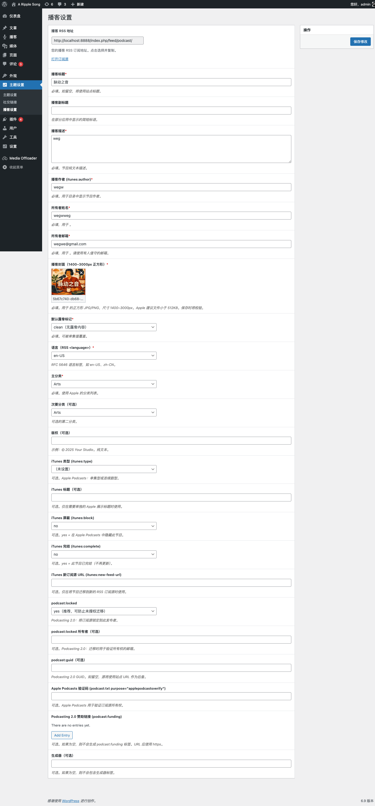
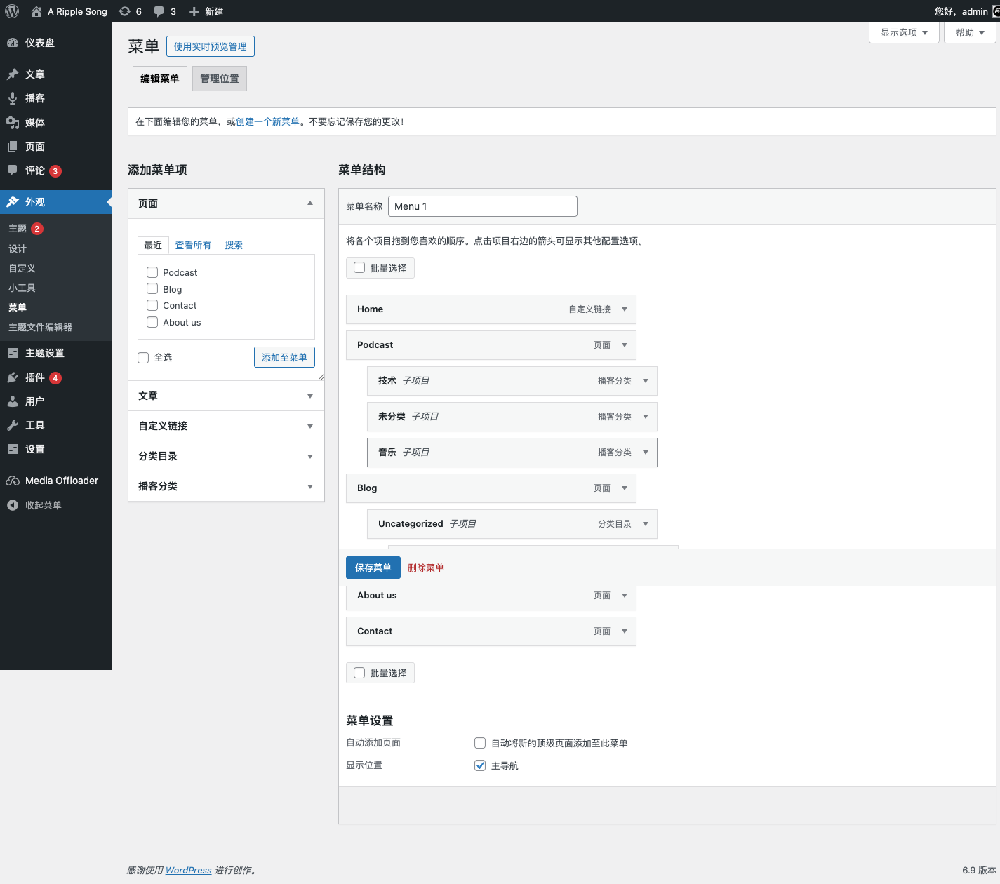
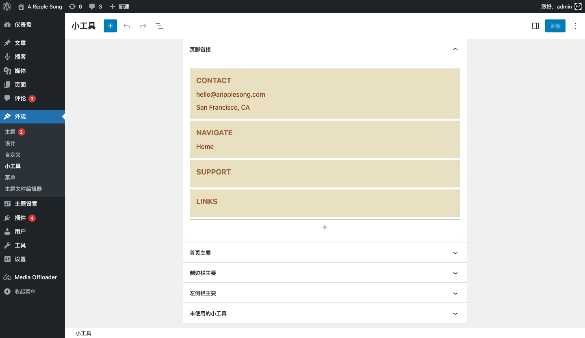
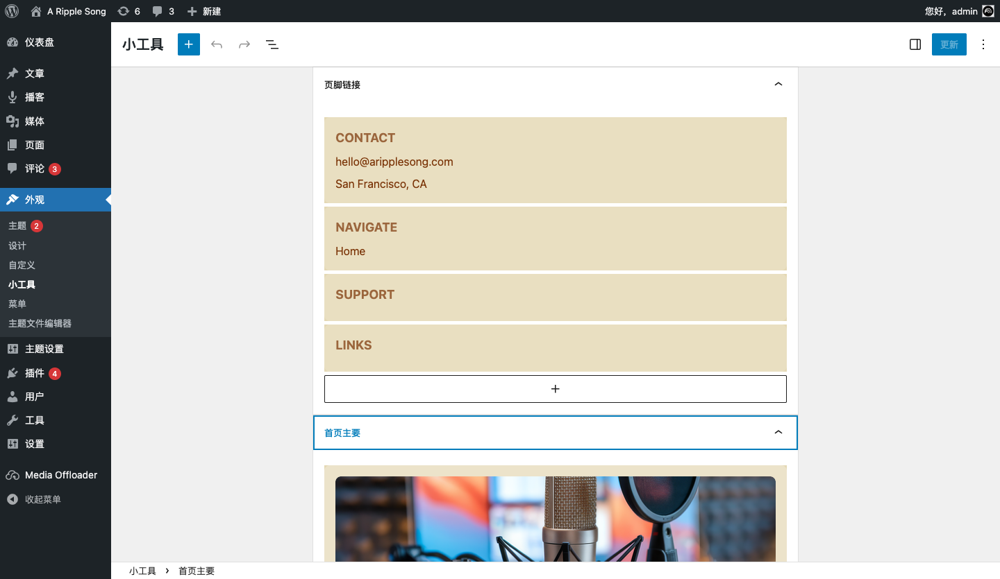

# 后台配置指南（WordPress Admin）

本指南覆盖启用主题、固定链接、页面模板、主题设置、菜单与小工具配置。

## 1) 登录后台

- 后台地址（本地示例）：`http://localhost:8888/wp-admin/`
- 登录后可看到仪表盘（见 `docs/screenshots/01-wp-admin-dashboard.png`）。

## 2) 启用主题

1. 进入「外观 → 主题」
2. 启用 `aripplesong`（后台展示为 Sage 起始主题/主题卡片，见 `docs/screenshots/17-themes-active.png`）

## 3) 固定链接（影响 RSS 地址）

1. 进入「设置 → 固定链接」
2. 推荐选择「文章名」

本地示例使用了带 `index.php` 的结构（见 `docs/screenshots/18-permalinks-settings.png`）。这会直接影响播客 RSS 的最终地址（详见 `docs/rss.md`）。

## 4) 必备页面与模板

主题内置 3 个页面模板：

- 播客模板：用于播客列表页（查询 `post_type=podcast`）
- 博客模板：用于博客列表页（查询 `post_type=post`）
- 自定义模板：用于普通页面展示（等同默认页面，但保留主题布局）

建议至少准备 2 个页面：

1. **Podcast** 页面
   - 推荐别名（slug）：`podcast`
   - 模板：选择「播客模板」（见 `docs/screenshots/12-page-template-picker.png`）
2. **Blog** 页面
   - 推荐别名（slug）：`blog`
   - 模板：选择「博客模板」

页面列表可在「页面 → 所有页面」查看（见 `docs/screenshots/11-pages-list.png`）。

## 5) 主题设置（Theme Settings）

主题通过 Carbon Fields 在后台提供「主题设置」菜单，包含多个子页面。

### 5.1 主题设置（通用）

进入「主题设置 → 主题设置」（见 `docs/screenshots/02-theme-settings-general.png`），常用项：

- **Site Logo**：上传并裁剪 Logo（建议 220×32）
- **Light Theme / Dark Theme**：选择 DaisyUI 主题（前台「切换主题」会基于该配置工作）
- **Footer Copyright**：覆盖页脚版权文案（留空使用默认）
- **Header Scripts / Footer Scripts**：注入统计代码等脚本

### 5.2 社交链接

进入「主题设置 → 社交链接」（见 `docs/screenshots/03-theme-settings-social-links.png`）：

- 每个输入框对应一个平台
- 留空则前台不展示该平台入口

### 5.3 播客设置（RSS 元信息）

进入「主题设置 → 播客设置」（见 `docs/screenshots/04-theme-settings-podcast-settings.png`）：

- 顶部提供 **Podcast RSS URL**，可点击复制/打开
- 包含 Apple Podcasts（iTunes）与 Podcasting 2.0 的频道级配置

详细字段与校验规则见 `docs/rss.md`。

## 6) 菜单（Primary Navigation）

主题注册了一个菜单位置：**Primary Navigation（主导航）**。

1. 进入「外观 → 菜单」
2. 创建/编辑菜单，并在「显示位置」勾选「主导航」

示例配置见 `docs/screenshots/10-menus-primary-navigation.png`。

## 7) 小工具与侧边栏布局

主题提供多个小工具区域（sidebars）：

- **Home Main（首页主要）**：首页中间内容区模块化搭建
- **Sidebar Primary（侧边栏主要）**：右侧边栏
- **Leftbar Primary（左侧栏主要）**：左侧作者/成员区等
- **Footer Links（页脚链接）**：页脚多列链接

进入「外观 → 小工具」进行配置（见 `docs/screenshots/08-widgets-screen.png`、`docs/screenshots/09-widgets-home-main-expanded.png`）。

### 7.1 主题自带小工具（Widgets）

后台中会出现一组以 `aripplesong -` 开头的小工具（用于搭建首页与侧栏）：

- **Banner Carousel**：横幅轮播（图片/链接/新窗口/描述）
- **Podcast List**：播客列表（最近/热门/随机 3 个 Tab）
- **Blog List**：博客列表（支持列数与“See all”链接）
- **Subscribe Links**：订阅入口（Apple Podcast / Spotify / Youtube Music）
- **Tags Cloud**：标签云（按标签文章数）
- **Authors List**：作者/成员列表（成员与嘉宾来自用户角色）
- **Footer Links**：页脚链接列（支持纯文本或链接、新窗口）

提示：主题在**首次启用**时会尝试为「Home Main」自动填充默认小工具组合（轮播 + 播客列表 + 博客列表）。

## 8) 用户与角色（用于成员/嘉宾显示）

主题把播客参与人员分为两类（用于前台作者列表与 RSS `podcast:person`）：

- **Members**：管理员 / 编辑 / 作者（administrator/editor/author）
- **Guests**：投稿者（contributor）

创建/调整用户角色请使用「用户」菜单完成。
