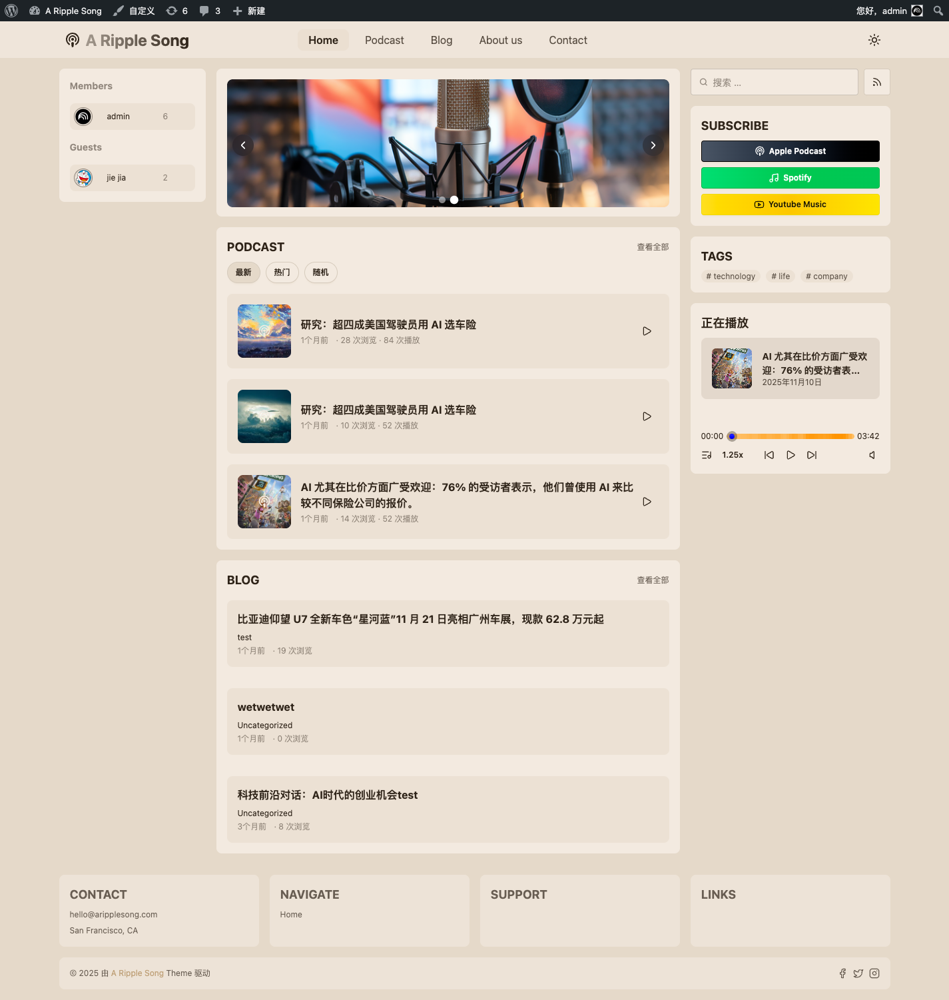
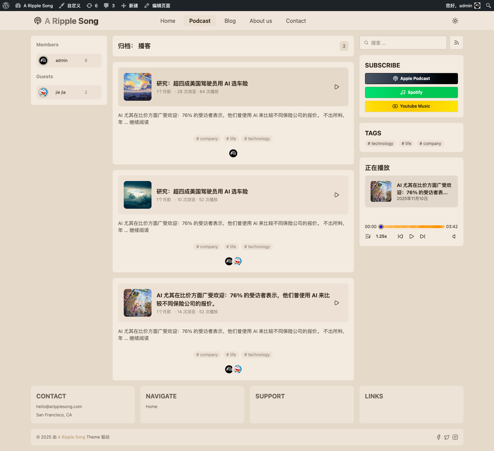
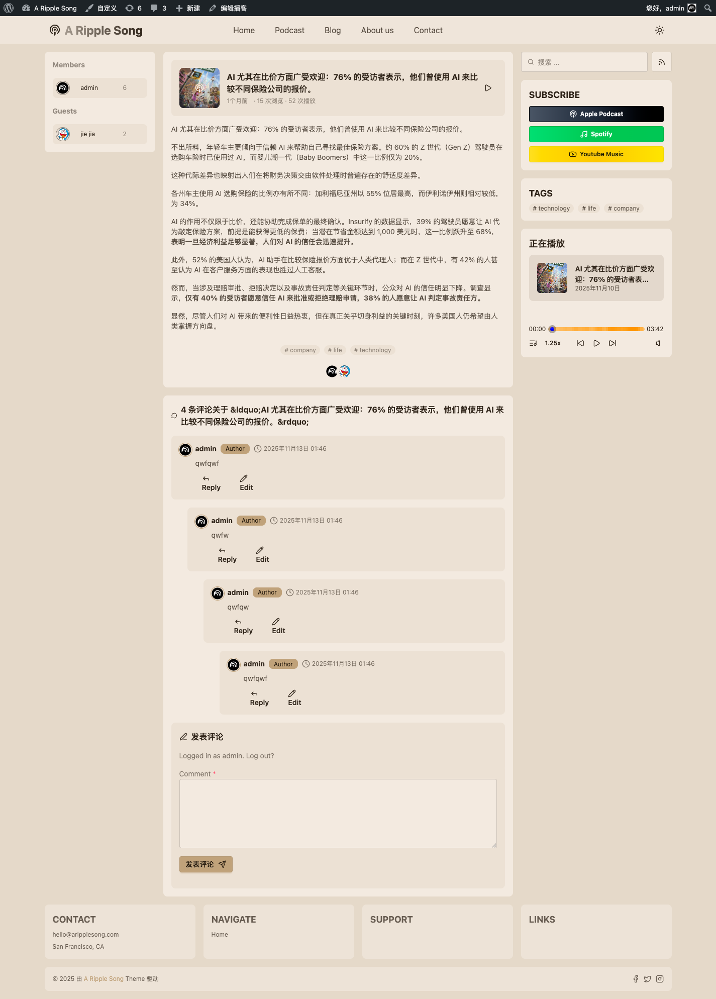

# 前台与播放器功能说明

本主题前台以「播客 + 博客」为主线，并提供全局音频播放器、播放列表与统计计数。

## 1) 首页结构（模块化）

首页内容主要由小工具组合构成（见 `docs/screenshots/13-frontend-home.png`）：

- Banner Carousel：顶部轮播
- Podcast List：最新/热门/随机
- Blog List：最新文章列表
- 侧边栏：订阅入口（SUBSCRIBE）、标签云（TAGS）、正在播放（NOW PLAYING）

对应的小工具配置见 `docs/admin.md` 的「小工具与侧边栏布局」。

## 2) 播客列表页

推荐通过页面模板「播客模板」生成播客列表页（通常为 `/podcast/`）：

- 列表展示每个单集卡片、摘要、标签、作者信息
- 支持分页

示例见 `docs/screenshots/14-frontend-podcast-archive.png`。

## 3) 播客单集详情页

播客详情页会展示：

- 单集卡片（封面/标题/播放按钮）
- 正文内容
- 标签与作者信息
- 评论区（默认开启）

示例见 `docs/screenshots/15-frontend-single-podcast.png`。

## 4) 全局音频播放器

播放器固定在页面底部（移动端为底部悬浮），支持：

- 播放/暂停、上一首/下一首
- 进度拖动与时长显示
- 音量与静音
- 播放倍速（支持面板选择）
- 播放列表（Playlist Drawer）
- 播放进度记忆（使用本地存储恢复）

## 5) 浏览/播放统计

主题会为公开内容记录：

- **浏览次数（views）**：所有公开 post type
- **播放次数（plays）**：仅播客（podcast）

这些数据通过前台 AJAX 自动累加，并在卡片/列表中展示为「次浏览 / 次播放」。
