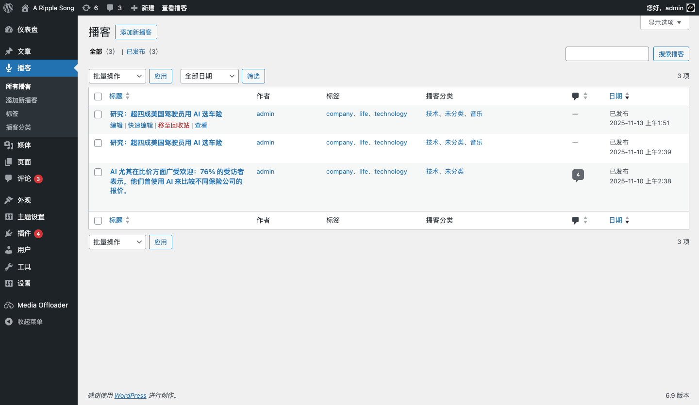
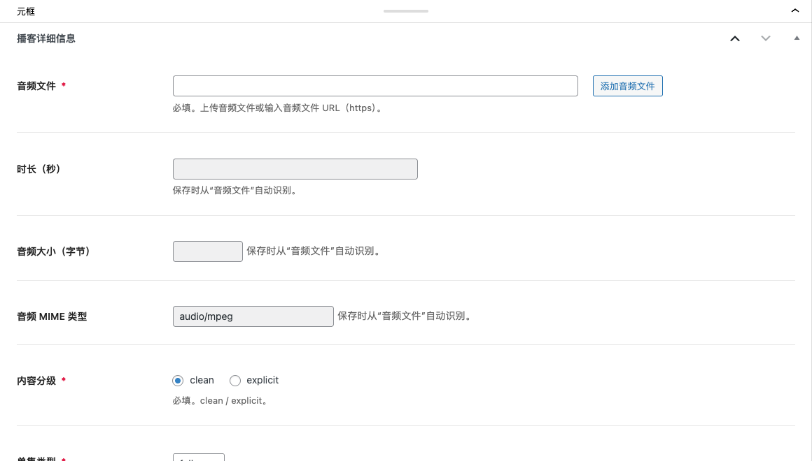

# 播客内容管理（Podcasts）

主题新增了一个自定义内容类型：**播客（post_type=podcast）**，用于发布每一期节目（单集）。

## 1) 播客列表入口

- 后台左侧菜单：**播客**
- 可在列表页管理所有单集（见 `docs/screenshots/05-podcasts-list.png`）

## 2) 新建播客单集

入口：后台「播客 → 添加新播客」。

编辑页会包含一个「播客详细信息」元框（CMB2），用于填写音频与 RSS 相关字段（见 `docs/screenshots/06-podcast-edit-metabox.png`；全页示例见 `docs/screenshots/07-podcast-add-new-full.png`）。

## 3) 必填字段（保存会校验）

以下字段未填写或不合法会导致保存失败：

- **音频文件（Audio File）**
  - 支持上传媒体库音频，或直接填写音频 URL（建议 `https`）
  - 主题会在保存时自动读取并写入：时长（seconds）、音频大小（bytes）、MIME
- **内容分级（Explicit）**：`clean` / `explicit`
- **单集类型（Episode Type）**：`full` / `trailer` / `bonus`

提示：在区块编辑器中，主题会锁定“发布/更新”按钮，直到检测到音频文件已填写。

## 4) 常用可选字段

根据你的发行平台需求选择填写：

- **集数 / 季数**：Apple Podcasts `itunes:episode` / `itunes:season`
- **单集作者（覆盖）**：覆盖频道作者
- **单集封面（正方形）**：覆盖频道封面（建议 1400–3000px 方图）
- **文字稿（Transcript）**：上传 vtt/srt/txt/pdf 或填写 URL（Podcasting 2.0 transcript）
- **章节（Chapters）**：上传/填写章节 JSON（Podcasting 2.0 chapters）
- **声音片段（Soundbites）**：可添加多个片段（Podcasting 2.0 soundbite）
- **iTunes 标题/副标题/摘要**：用于 Apple 展示字段
- **自定义 GUID**：不填则默认使用固定链接
- **iTunes 屏蔽**：`yes` 时 Apple Podcasts 隐藏该集

## 5) 成员与嘉宾（人员署名）

在「播客详细信息」中可选择：

- **成员（Members）**：只能选管理员/作者/编辑（可多选）
- **嘉宾（Guests）**：只能选投稿者（可多选）

这些信息会影响：

- 前台左侧栏的作者列表（Members/Guests）
- 作者归档页展示（包含“参与过的播客”）
- RSS 里 `podcast:person` 的生成（详见 `docs/rss.md`）

## 6) 分类与标签

播客支持两套归类方式：

- **标签（post_tag）**：与普通文章共用标签体系
- **播客分类（podcast_category）**：层级分类（独立 taxonomy）

可在编辑器右侧面板中添加/勾选。

## 7) 评论

新建播客默认开启评论（comment_status=open）。如需关闭：

- 在编辑器右侧「讨论」中关闭，或使用站点级讨论设置。
