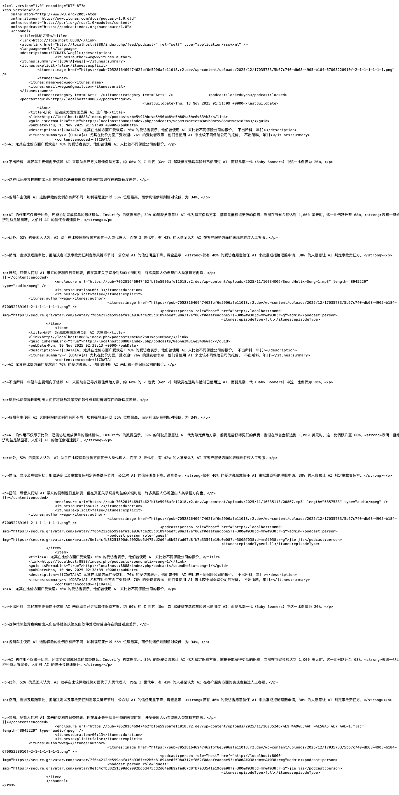

# RSS 订阅源（Apple Podcasts / Spotify / Podcasting 2.0）

主题提供专用播客订阅源：`feed=podcast`，并生成符合 Apple Podcasts 与 Podcasting 2.0 命名空间的 RSS。

## 1) 在后台找到你的 RSS 地址

进入「主题设置 → 播客设置」，顶部会显示 **Podcast RSS URL**（可点击复制/打开）（见 `docs/screenshots/04-theme-settings-podcast-settings.png`）。

RSS 地址会随固定链接设置变化，常见三种情况：

1. 未启用固定链接：`/?feed=podcast`
2. 固定链接带 `index.php`：`/index.php/feed/podcast/`（本地示例见 `docs/screenshots/18-permalinks-settings.png`）
3. 完整美化链接：`/feed/podcast/`

示例 RSS 页面（浏览器直接打开的原始 XML）：`docs/screenshots/16-podcast-rss-feed.png`。

## 2) 频道级字段（在“播客设置”里配置）

在「主题设置 → 播客设置」中建议至少填写：

- **Podcast Title / Description / Author**
- **Owner Name / Owner Email**
- **Podcast Cover（itunes:image）**

封面图会被严格校验（保存时提示错误）：

- 必须正方形
- 分辨率 1400×1400 至 3000×3000
- 格式 JPG/PNG
- 建议小于 512KB（Apple 推荐）

你还可以配置：

- **Language（RSS <language>）**
- **Explicit（itunes:explicit）**
- **iTunes 分类（主/次）**
- **itunes:type / itunes:block / itunes:complete / itunes:new-feed-url**
- **podcast:locked / podcast:guid / podcast:txt（applepodcastsverify）**
- **podcast:funding（可多条）**

## 3) 单集字段如何映射到 RSS

每篇「播客」文章（单集）会生成一个 `<item>`，其中关键字段来自 `播客详细信息` 元框：

- **Audio File** → `<enclosure url="..." length="..." type="...">`
- **Duration（自动识别）** → `<itunes:duration>`
- **Explicit** → `<itunes:explicit>`
- **Episode Type** → `<itunes:episodeType>`
- **Episode Number / Season Number** → `<itunes:episode>` / `<itunes:season>`
- **Episode Cover**（可选）→ `<itunes:image>`（覆盖频道封面）
- **Transcript / Chapters / Soundbites**（可选）→ Podcasting 2.0 标签
- **Members / Guests** → `<podcast:person role="host/guest">`（包含头像等信息）

## 4) 发布平台注意事项

- Apple Podcasts/Spotify 等平台通常要求频道级信息完整（标题、简介、作者、封面、Owner 邮箱）。
- 如果你修改了固定链接结构，建议重新确认 RSS 地址，并在平台后台更新订阅源 URL（如需要迁移，可使用 `itunes:new-feed-url`）。
